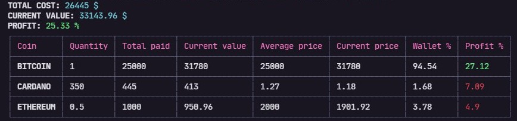

# crypto-wallet-cli

A CLI to manage your cryptocurrencies wallet profit



## Install

```bash
$ npm install -g crypto-wallet-cli
```

## Usage 

Create a .json file with all your transactions (buy and sell). See [transactions-example.json](./transactions-example.json)

```bash
$ crypto-wallet -p "path/to/json_file.json
```

## Local installation instructions

- Clone this repository

    ```bash
    $ git clone git@github.com:anajuliabit/crypto-wallet-cli.git
    ```
- Export environment variable API_URL or create .env file (see [.env.example](./.env.example))

    ```bash
    $ export API_URL=https://api.coingecko.com/api/v3
    ```
- Run

    ```bash
    $ npm install
    ``` 
- Create a .json file with all your transactions (buy and sell). See [transactions-example.json](./transactions-example.json)

- Run 

    ```bash
    $ npm start -- -p /path/to/json_file.json
    ```


